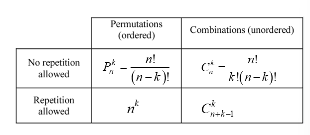

# Chương 1: Vai trò của thống kê trong kỹ thuật

## 1. Thống kê trong kỹ thuật

- Tham số là số liệu mô tả dân số
- Thống kê là tính toán dựa trên dữ liệu mẫu

## 2. Thu thập dữ liệu

Có 3 phương pháp thu thập dữ liệu:

    1. Nghiên cứu hồi cứu: phân tích, nghiên cứu dữ liệu đã có trong quá khứ.

    2. Nghiên cứu quan sát: quan sát các đối tượng cần nghiên cứu và không can thiệp

    3. Thí nghiệm có thiết kế: các nhà nghiên cứu chủ động thay đổi các yếu tố đầu vào (biến độc lập)

VD:
    a) Một công ty tiếp thị thực hiện khảo sát để tìm hiểu có bao nhiêu người sử dụng một sản phẩm. Trong số 100 người được liên hệ, 15 người cho biết họ sử dụng sản phẩm: Loại nghiên cứu: Observational Study (Nghiên cứu quan sát)

    - Lý do: Công ty chỉ tiến hành khảo sát và thu thập thông tin từ người dùng.

    - Không có sự can thiệp: Công ty không kiểm soát ai sử dụng sản phẩm hoặc không sử dụng.

    - Không có nhóm đối chứng: Tất cả đối tượng chỉ được hỏi về việc sử dụng sản phẩm, không có sự phân nhóm hoặc thử nghiệm.

    b) Một phòng khám cung cấp thuốc cho một nhóm 10 bệnh
    nhân và giả dược (placebo) cho một nhóm 10 bệnh nhân khác để tìm hiểu xem thuốc có tác dụng với bệnh của bệnh nhân không: Loại nghiên cứu: Experimental Study (Thí nghiệm có thiết kế)

    - Lý do: Phòng khám kiểm soát và can thiệp vào phương pháp điều trị của bệnh nhân.

    - Có nhóm đối chứng:

    - Nhóm điều trị: 10 bệnh nhân nhận thuốc thật.

    - Nhóm đối chứng (placebo): 10 bệnh nhân nhận viên giả dược.

    - Có sự phân bổ ngẫu nhiên (Randomization): Để đảm bảo tính khách quan, bệnh nhân có thể được phân ngẫu nhiên vào hai nhóm.

## 3. Dữ liệu là gì?

Các loại data:  1. Dữ liệu định tính
                2. Dữ liệu định lượng

## 4. Lỗi

1. Lỗi chấp nhận được: có sự khác biệt giữa kết quả thống kê và kết quả khảo sát.
2. Lỗi không chấp nhận được: dữ liệu lấy mẫu bị thu thập sai, phân tích sai do nhiều yếu tố.

## 5. Phương pháp đếm

### Quy tắc nhân:

- Áp dụng khi thống kê một quá trình được thực hiện tuần tự theo k bước.
- Tổng số các để hoàn tất quá trình là:

>${n_1\times n_2\times ...\times n_k}$

VD: Thiết kế 1 Website phải có 4 màu, 3 phông, 3 vị trí có thể cho một bức ảnh. Có ${4\times 3\times 3=36}$ mẫu thiết kế có thể có.

### Hoán vị

- Số các hoán vị của n phần tử khác nhau là n! 

>${n!=n\times(n-1)\times(n-2)\times...\times 2\times 1}$

VD: Cho tập ${S=\{a, b, c\}}$. Số các hoán vị của tập S là: ${3!=6}$

### Hoán vị các đối tượng tương tự

- Số các hoán vị của n phần tử mà trong đó ${n=n_1+n_2+...+n_r}$ đối tượng với ${n_1, n_2, n_3,...}$ là từng loại có số phần tử tương ứng.

> ${\frac{n!}{n_1!\times n_2!\times n_3!\times...\times n_r!}}$

VD: Một bệnh viện cần phẫu thuật 3 ca đầu gối (k) và 2 ca bả vai (h) một ngày. Số các trường hợp có thể xảy ra thỏa điều kiện: ${\frac{5!}{2!\times 3!}=10}$

### Hoán vị ${P^{k}_n} và tổ hợp ${C^{k}_n}$

- Hoán vị là cách **sắp xếp** các đối tượng có tính đến vị trí (**có thứ tự**)
- Tổ hợp là cách **chọn** các đối tượng không quan tâm đến thứ tự (**không có thứ tự**)

  

VD:

1. Một bo mạch có 8 vị trí khác nhau có thể đặt các linh kiện. Nếu 4 linh kiện khác nhau được đặt lên bo, có bao nhiêu cách có thể để thiết kê bo mạch?

    Có 4 linh kiện khác nhau, **thứ tự** giữa các linh kiện là *quan trọng*, mỗi linh kiện chỉ được lấy **đúng 1 lần**:
    >${P^4_8=\frac{8!}{4!}=1680}$

2. Một bo mạch có 8 vị trí khác nhau có thể đặt các linh kiện. Nếu 5 linh kiện giống hệt nhau được đặt lên bo, có bao nhiêu cách thiết kế bo mạch?

    Có 5 linh kiện giống nhau, **thứ tự** giữa các linh kiện *không quan trọng*, mỗi linh kiện chỉ lấy **đúng 1 lần**:
    >${C^5_8=\frac{8!}{3!\times 5!}}$

3. Một thùng chứa có 50 linh kiện, trong đó có 3 linh kiện bị lỗi, 47 linh kiện không bị lỗi. Một mẫu 6 linh kiện lấy từ 50 linh kiện và không hoàn lại. Ta có, mỗi phần có thể được chọn chỉ 1 lần, và mẫu kiểm là tập con của 50 linh kiện. Có bao nhiêu mẫu thử khác nhau có kích thước là 6 và có chính xác 2 linh kiện lỗi?

    1. Chọn ra 2 linh kiện từ 3 linh kiện lỗi:
    >${C^2_3=\frac{3!}{2!\times 1!}=3}$
    2. Chọn ra 4 linh kiện từ 47 linh kiện không bị lỗi:
    >${C^4_47=\frac{47!}{4!\times 43!}=178,365}$
    3. Chọn mẫu thử có kích thước là 6:
    >${C^2_3\times C^4_47=3\times 178,365=535,095}$ samples
